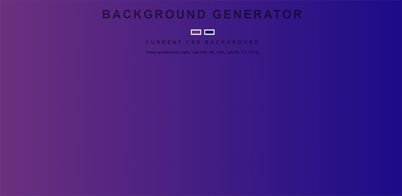

#Background Generator

This is an open source project originally created for a Javascript class at [Zero to Mastery](https://zerotomastery.io/). Feel free to fork this repo and add features of your own.

## Table of contents

- [Overview](#overview)
    - [The challenge](#the-challenge)
    - [Features to add](#features-to-add)
    - [Screenshot](#screenshot)
    - [Links](#links)
- [My process](#my-process)
    - [Built with](#built-with)
- [Author](#author)

## Overview
A useful background generator for any web project. Just select the two colors you would like to use for you gradient. Then copy and paste the resulting linear gradient to your css. The page background will change to reflect the selected colors.

### The challenge

Users should be able to:

- Select the two colors needed for the linear gradient
- Click the random button to generate a random gradient
- Copy and paste the custom css gradient text

### Features to add

These features still need to be added:

- Random background generation button
- Display the initial CSS linear gradient property on page load

### Screenshot

### Links

- Live Site URL: [GitHub](https://your-live-site-url.com)

## My process

### Built with

- Semantic HTML5 markup
- CSS custom properties
- Javascript

## Author

- Website - [Walker Designs](https://www.your-site.com)
- GitHub - [robertWalker68501](https://github.com/robertWalker68501)
- Facebook - [Robert Walker](https://www.facebook.com/profile.php?id=100069751196537)
- Twitter - [@RobertW15135868](https://twitter.com/RobertW15135868)